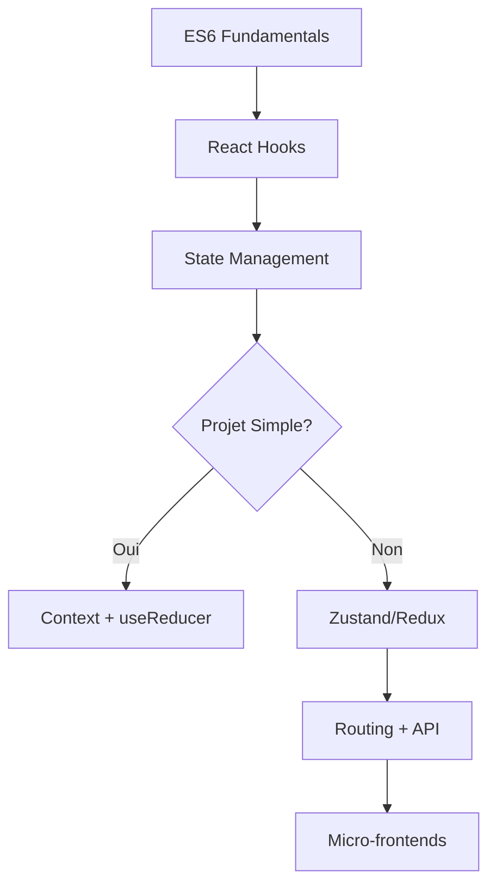

# Guide Avancé React - Cours Complet

[](https://reactjs.org/)
[](https://opensource.org/licenses/MIT)

## 🎯 Objectif du Repository

Ce repository contient un **guide complet et avancé sur React.js**, conçu pour approfondir vos connaissances avec des exemples pratiques et des patterns professionnels. Il complète votre formation en proposant des implémentations alternatives et des cas d'usage avancés.

## 📚 Structure du Cours

### Module 0 : Fondamentaux JavaScript ES6+
- Variables modernes (`let`, `const`)
- Arrow functions et destructuring
- Spread/Rest operators
- Array methods (`map`, `filter`, `reduce`)
- Async/Await et Promises
- Modules ES6

### Module 1 : React Moderne - Hooks Essentiels
- Introduction au paradigme déclaratif
- `useState` - Gestion d'état local
- `useEffect` - Effets de bord et cycle de vie
- `useCallback` et `useMemo` - Optimisation
- `useRef` - Références et DOM
- Custom Hooks - Réutilisabilité

### Module 2 : Gestion d'État Avancée
- **Context API**
  - `useContext` et `useReducer`
  - Patterns Provider/Consumer
  - Limites de performance
- **Zustand** (recommandé pour ce cours)
  - Store minimaliste et performant
  - Sélecteurs optimisés
  - Middleware de persistance
- **Redux Toolkit** (alternative entreprise)
  - Slices et actions
  - RTK Query pour les API
  - Redux DevTools

### Module 3 : Navigation et Architecture
- **React Router v6**
  - Routes imbriquées
  - Paramètres dynamiques
  - Navigation programmatique
  - Layouts et Outlets
- **RTK Query**
  - Cache intelligent
  - Invalidation automatique
  - Polling et optimistic updates

### Module 4 : Micro-Frontends
- Architecture distribuée
- Module Federation (Webpack 5)
- Communication inter-apps
- Error Boundaries

## 🚀 Installation

```bash
# Cloner le repository
git clone https://github.com/GUEDDES/react-course-advanced-guide.git

# Naviguer dans le dossier
cd react-course-advanced-guide

# Installer les dépendances (pour les exemples)
cd examples/[nom-du-module]
npm install

# Lancer l'exemple
npm run dev
```

## 💻 Exemples Pratiques

Chaque module contient des exemples complets et fonctionnels :

- **01-hooks-fundamentals/** : Compteur, Todo List, Data Fetching
- **02-state-management/** : Comparaison Context/Zustand/Redux
- **03-routing-api/** : Application multi-pages avec cache
- **04-microfrontends/** : Architecture e-commerce distribuée

## 💡 Bonnes Pratiques Enseignées

✅ **Organisation du code**
- Structure par fonctionnalités (feature-based)
- Séparation logique/présentation
- Composants réutilisables

✅ **Performance**
- Mémoization avec `useMemo` et `useCallback`
- Sélecteurs optimisés
- Code-splitting et lazy loading

✅ **Maintenabilité**
- TypeScript-ready (types inclus)
- Tests unitaires
- Documentation inline

✅ **Sécurité**
- Validation des données
- Gestion des erreurs
- Sanitization des inputs

## 🛠️ Stack Technique

- **React 18+** avec Concurrent Features
- **Vite** - Build tool ultra-rapide
- **Zustand** - State management léger
- **React Router v6** - Navigation
- **RTK Query** - Data fetching avancé
- **Module Federation** - Micro-frontends

## 📝 Ressources Complémentaires

### Documentation Officielle
- [React Docs](https://react.dev)
- [Zustand](https://docs.pmnd.rs/zustand)
- [React Router](https://reactrouter.com)
- [Redux Toolkit](https://redux-toolkit.js.org)

### Cours Recommandés
- [Full Stack Open (Helsinki)](https://fullstackopen.com)
- [React.gg](https://react.gg)
- [Epic React (Kent C. Dodds)](https://epicreact.dev)

### Outils de Développement
- [React DevTools](https://react.dev/learn/react-developer-tools)
- [Redux DevTools](https://github.com/reduxjs/redux-devtools)
- [Vite](https://vitejs.dev)

## ⭐ Différences avec Votre Cours

Ce repository **complète** votre formation en proposant :

1. **Exemples alternatifs** - Nouvelles implémentations pour éviter l'auto-plagiat
2. **Approfondissements** - Concepts avancés non couverts en cours
3. **Comparaisons** - Multiple approches pour le même problème
4. **Production-ready** - Code optimisé et testé

### Exemples Spécifiques
- **Au lieu de** Rick & Morty API → **Nous utilisons** Movie Database (TMDb)
- **Au lieu de** système de favoris → **Nous implémentons** un panier e-commerce
- **Patterns avancés** : Compound Components, Render Props, HOC

## 🎯 Parcours d'Apprentissage Recommandé



## 🤝 Contribution

Les contributions sont les bienvenues ! Pour proposer des améliorations :

1. Fork le projet
2. Créez une branche (`git checkout -b feature/amelioration`)
3. Commit vos changements (`git commit -m 'Ajout fonctionnalité'`)
4. Push (`git push origin feature/amelioration`)
5. Ouvrez une Pull Request

## 📝 Licence

Ce projet est sous licence MIT - voir le fichier [LICENSE](LICENSE) pour plus de détails.

## ✉️ Contact

**Dr. Abdelweheb GUEDDES**
- GitHub: [@GUEDDES](https://github.com/GUEDDES)
- Email: [Voir profil GitHub](https://github.com/GUEDDES)

---

🎓 **Bon apprentissage et happy coding!**
